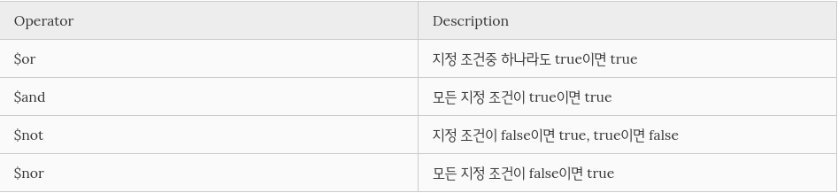
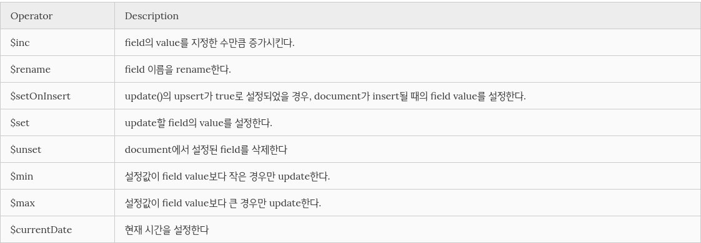

# MongoDB 기본 학습
MongoDB와 Pymongo API 학습 정리 자료

## MongoDB

### MongoDB Shell

##### - run & stop
```sh
$ sudo serverice mongod start
```
몽고DB를 실행한다.
```sh
$ mongo
```
몽고DB shell 실행한다.
```sh
$ sudo serverice mongod stop
```
몽고DB를 종료한다.

##### - create
```sh
> use <database_name> 
```
<database_name>에 맞는 database를 생성한다.
이미 존재할 경우 해당 db를 사용한다.
```sh
> db
```
현재 사용 중인 database를 확인한다.
```sh
> show dbs
```
데이터 베이스 리스트를 확인한다.
```sh
> db.<collection 이름>.insert(<추가할 document>)
```
1개 이상의 document를 추가해야 database가 실제로 생성된다. 또한 여러 개의 document를 한번에 insert 할 수 있다. document의 _id는 임의로 생성 된다.
##### - read
```sh
> show collections
or
> db.getCollectionNames()
```
collection list를 확인한다.
```sh
> db.<collection 이름>.find(<선택 기준(query)>,<선택 결과에 포함될 필드>)
or
> db.<collection 이름>.find(<선택 기준(query)>,<선택 결과에 포함될 필드>).pretty()
```
find()함수에 아무 인자도 주지 않을 경우 collection 내의 모든 document를 선택한다. 두번째 인자를 사용할 경우 선택 기준 인자에 {}를 넣어 아무 인자도 넣지 않음을 표시한다. 이는 다른 API에서도 동일하다. pretty()를 사용하면 return data를 format에 맞게 출력한다. 쿼리 연산자를 이용하여 쿼리 옵션을 쉽게 표현할 수 있다.<br><br>
비교 연산자\


논리 연산자\


##### - update
```sh
> db.<collection 이름>.update(
    <선택 기준(query)>,
    <update할 내용>,
    {
      upsert: <boolean>,
      multi: <boolean>,
      writeConcern: <document>
    }
)
```
선택 기준에 따라 update할 대상을 선택한다. upsert를 true로 하면 선택 기준에 맞는 Document가 없을 경우 insert한다. multi를 true로 하면 선택 기준에 맞는 document들을 모두 update한다. false일 경우 하나의 document만 update한다. wrtieConcern은 영속화를 위한 설정인데 자주 사용하지 않는다. 해당 옵션들은 default가 false이다.

MongoDB Update field operator\

##### - delete 
```sh
> db.collection.remove(
  <선택 기준(query)>,
  {
    justOne: <boolean>,
    writeConcern: <document>
  }
)
```
선택 기준에 따라 delete할 대상을 선택한다. justOne을 true로 하면 기준에 맞는 Document를 1개 삭제한다. wrtieConcern은 영속화를 위한 설정인데 자주 사용하지 않는다. 해당 옵션들은 default가 false이다.
```sh
> db.<collection 이름>.drop()
```
해당 collection을 삭제한다.
```sh
> db.dropDatabase()
```
Database를 삭제한다.


